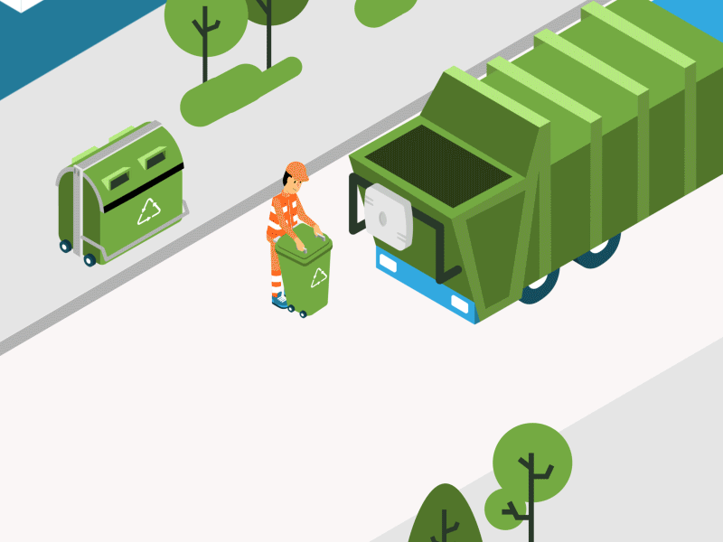

<p align="center">
  
</p>

# E-Waste Management Platform

<p align="center">
  <b>Grand Finalist at Technothon, VES Polytechnic, Chembur</b><br/>
  <i>Empowering responsible e-waste disposal and awareness</i>
</p>

---

## 🏆 About the Project

This project was built for the <b>Technothon Hackathon</b> at <b>VES Polytechnic, Chembur</b>. Our team was selected as a <b>Grand Finalist</b> for our innovative approach to e-waste management, combining technology and social impact.

---

## 🚀 Tech Stack

<p align="center">
  
  
  
  
  
  
</p>

- **Next.js** (App Router)
- **React 19**
- **Tailwind CSS** & custom CSS
- **TypeScript**
- **Firebase** (for backend & authentication)
- **Radix UI** (for accessible UI components)

---

## 🌟 Features

- Agency search and dashboard
- User and agency login
- E-waste disposal request form
- Awareness articles and resources
- Modern, responsive UI

---

## 🖼️ Visuals

<p align="center">
  
</p>

---

## 🛠️ Getting Started

```bash
npm install
npm run dev
```

Open [http://localhost:3000](http://localhost:3000) to view the app.

---

## 👥 Team & Credits

- Built by a passionate team for Technothon 2024
- Special thanks to VES Polytechnic, Chembur

---

<p align="center">
  <i>Let's make e-waste disposal smarter and greener!</i>
</p>
